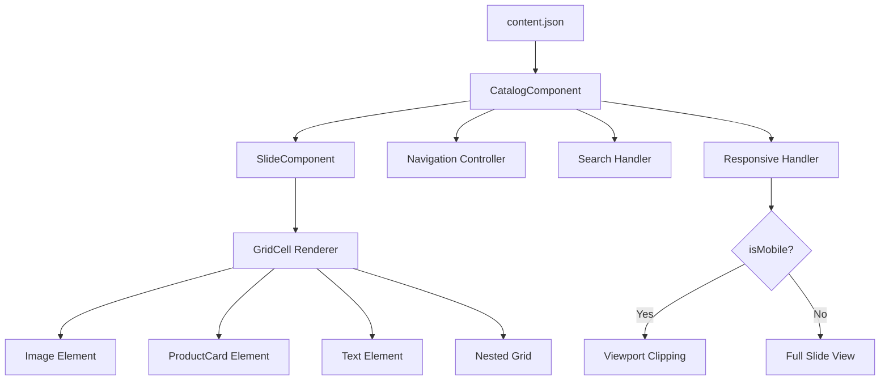

# Configurable Slide Component System

Create a unified, JSON-driven slide component system that replaces the current 50+ individual slide components with a single configurable `SlideComponent` and a `CatalogComponent` for navigation.

## User Review Required

> [!IMPORTANT]
> **Breaking Change**: This refactor will replace all existing `Slide*.tsx` files with a new data-driven approach. The existing components will be deprecated.

> [!WARNING]
> **Mobile Strategy Decision**: The proposed approach uses CSS viewport clipping rather than building separate mobile components. This means we render the full desktop slide and "crop" to show only the relevant portion (top-left, top-right, etc.) on mobile. Please confirm this approach vs. building separate mobile layouts.

---

## Architecture Overview



---

## Proposed JSON Schema

### Slide Configuration Structure

```typescript
interface SlideConfig {
  id: string;                           // Unique slide identifier
  className?: string;                   // Additional CSS classes
  backgroundColor?: string;             // Background color/image
  padding?: string;                     // Tailwind padding classes
  
  // Mobile viewport configuration
  mobileViewports: 2 | 4;               // How many sub-sections on mobile (2 or 4)
  
  // Grid layout definition
  layout: GridLayout | FlexLayout;
  
  // Slide content data
  content: SlideContent;
  
  // Optional popup dialogs for product cards
  popups?: Record<string, ProductPopup[]>;
  
  // Menu navigation (which menu items link to this slide)
  menuLinks?: string[];
}
```

### Grid Layout Constructor

```typescript
interface GridLayout {
  type: 'grid';
  columns: number | string;            // e.g., 2 or "1fr 2fr" 
  rows?: number | string;              // Optional row definition
  gap?: string;                        // Gap between cells
  className?: string;
  cells: GridCell[];
}

interface FlexLayout {
  type: 'flex';
  direction: 'row' | 'column';
  gap?: string;
  className?: string;
  align?: string;
  justify?: string;
  children: (GridCell | FlexLayout | GridLayout)[];
}

interface GridCell {
  id: string;                          // Cell identifier
  
  // Grid positioning (CSS Grid notation)
  gridColumn?: string;                 // e.g., "1 / 3" or "span 2"
  gridRow?: string;                    // e.g., "1 / 2"
  
  // Size constraints
  maxWidth?: string;
  maxHeight?: string;
  className?: string;
  
  // Content type
  content: CellContent;
}
```

### Cell Content Types

```typescript
type CellContent = 
  | ImageContent 
  | ProductCardContent 
  | TextContent 
  | TitleContent
  | NestedGridContent
  | NestedFlexContent;

interface ImageContent {
  type: 'image';
  src: string;                         // Can use {locale} placeholder
  alt: string;
  width?: number;
  height?: number;
  className?: string;
  onClick?: ClickAction;               // Optional click handler
}

interface ProductCardContent {
  type: 'productCard';
  imageSrc: string;
  alt?: string;
  imgClassName?: string;
  variant?: 'default' | 'floating' | 'no-button';
  buttonText?: string;
  popupKey?: string;                   // References popups dictionary
  onClick?: ClickAction;
}

interface TextContent {
  type: 'text';
  textKey: string;                     // i18n translation key
  className?: string;
  element?: 'p' | 'span' | 'h1' | 'h2' | 'h3'; 
}

interface TitleContent {
  type: 'title';
  titleKey: string;                    // i18n translation key
  variant?: 'bg-transparent' | 'bg-solid';
  className?: string;
}

interface NestedGridContent {
  type: 'grid';
  layout: GridLayout;
}

interface NestedFlexContent {
  type: 'flex';
  layout: FlexLayout;
}

interface ClickAction {
  action: 'popup' | 'menu' | 'link';
  target: string;                      // Popup key, menu label, or URL
}
```

### Product Popup Configuration

```typescript
interface ProductPopup {
  src: string;                         // Image source with {locale} placeholder
  href: string;                        // Product link (locale variations)
  hrefs?: Record<string, string>;      // Per-locale URLs
  imgClassName?: string;
  productData: {
    name: string;
    id: string | Record<string, string>;    // Can be per-locale
    price: string | Record<string, string>; 
    category: string;
    variant: string;
  };
}
```

---

## Example Slide JSON

```json
{
  "slide2": {
    "id": "slide2",
    "className": "p-[30px]",
    "mobileViewports": 2,
    "layout": {
      "type": "flex",
      "direction": "row",
      "gap": "16px",
      "className": "h-100 w-full",
      "children": [
        {
          "type": "flex",
          "direction": "column",
          "gap": "20px",
          "className": "h-full w-full max-w-[67.52%] max-h-[644px]",
          "children": [
            {
              "id": "main-image",
              "content": {
                "type": "image",
                "src": "/images/{locale}/slide2/background.jpg",
                "alt": "slide2",
                "className": "h-full w-full max-w-[763px] max-h-[644px]"
              }
            },
            {
              "id": "title-overlay",
              "className": "absolute left-[70px] top-[101px]",
              "content": {
                "type": "title",
                "titleKey": "slide2.title",
                "variant": "bg-transparent",
                "className": "!text-[45px]"
              }
            }
          ]
        },
        {
          "type": "grid",
          "columns": 2,
          "gap": "16px",
          "className": "max-w-[30%]",
          "cells": [
            {
              "id": "card-1",
              "content": {
                "type": "productCard",
                "imageSrc": "/images/{locale}/slide2/energia.jpg",
                "alt": "gasolina",
                "variant": "floating",
                "popupKey": "popUp1"
              }
            }
          ]
        }
      ]
    },
    "popups": {
      "popUp1": [
        {
          "src": "/images/{locale}/slide2/popup/popup_00.png",
          "href": "",
          "productData": {
            "name": "Husqvarna 120iTK4-P",
            "id": "18636",
            "price": "399",
            "category": "PopUp",
            "variant": "PopUp"
          }
        }
      ]
    }
  }
}
```

---

## Mobile Viewport Strategy

For responsive handling, we use **CSS viewport clipping**:

1. **Desktop (≥1024px)**: Render full slide layout
2. **Mobile (<1024px)**: Use CSS `transform: scale()` + `overflow: hidden` + positioning to show only a portion of the slide

```typescript
interface MobileViewport {
  position: 'top-left' | 'top-right' | 'bottom-left' | 'bottom-right' | 'left' | 'right';
  scaleX?: number;
  scaleY?: number;
  translateX?: string;
  translateY?: string;
}
```

The `CatalogComponent` will:
1. Calculate the current mobile viewport index based on `activeSlide` 
2. Apply CSS transforms to show the appropriate section
3. Map mobile slide indices to desktop slide indices for navigation

---

## Proposed Changes

### Types & Interfaces

#### [NEW] [slide.types.ts](file:///home/miguelaguiar/Work/BySidecar/Testing/husqvarna-catalogo-boilerplate/src/types/slide.types.ts)

All TypeScript interfaces for slide configuration including:
- `SlideConfig`, `GridLayout`, `FlexLayout`, `GridCell`
- `CellContent` union types (Image, ProductCard, Text, Title, NestedGrid)
- `ProductPopup`, `ClickAction`, `MobileViewport`
- Helper type guards for content type checking

---

### Core Components

#### [NEW] [SlideComponent.tsx](file:///home/miguelaguiar/Work/BySidecar/Testing/husqvarna-catalogo-boilerplate/src/components/catalog/SlideComponent.tsx)

Single unified slide renderer that:
- Accepts `SlideConfig` as props
- Recursively renders grid/flex layouts
- Handles cell content rendering (images, product cards, text, nested grids)
- Manages popup dialog state
- Supports `isActive` prop for animations

#### [NEW] [CatalogComponent.tsx](file:///home/miguelaguiar/Work/BySidecar/Testing/husqvarna-catalogo-boilerplate/src/components/catalog/CatalogComponent.tsx)

Main catalog controller that:
- Loads slides configuration from JSON
- Renders slides using `SlideComponent`
- Handles mobile viewport switching
- Manages navigation state (activeSlide)
- Provides menu navigation callbacks
- Implements search functionality

#### [NEW] [GridRenderer.tsx](file:///home/miguelaguiar/Work/BySidecar/Testing/husqvarna-catalogo-boilerplate/src/components/catalog/GridRenderer.tsx)

Recursive layout renderer that:
- Constructs CSS Grid layouts from config
- Constructs Flexbox layouts from config
- Handles nested layouts
- Applies positioning and styling

#### [NEW] [CellRenderer.tsx](file:///home/miguelaguiar/Work/BySidecar/Testing/husqvarna-catalogo-boilerplate/src/components/catalog/CellRenderer.tsx)

Content renderer for individual cells:
- Image rendering with locale interpolation
- ProductCard with popup triggers
- Text/Title with i18n integration
- Click handlers for navigation

---

### Configuration

#### [MODIFY] [content.json](file:///home/miguelaguiar/Work/BySidecar/Testing/husqvarna-catalogo-boilerplate/content.json)

Extend the existing structure with new `slidesV2` section containing the new JSON-based slide definitions. This allows gradual migration.

---

### Page Integration

#### [MODIFY] [index.tsx](file:///home/miguelaguiar/Work/BySidecar/Testing/husqvarna-catalogo-boilerplate/src/pages/%5Blocale%5D/index.tsx)

Update to use `CatalogComponent` instead of individual slide imports:
- Remove 50+ slide component imports
- Replace carousel slides arrays with single `CatalogComponent`
- Pass configuration and callbacks to CatalogComponent

---

## Implementation Notes

### Locale Interpolation

Image paths use `{locale}` placeholder that gets replaced at render time:
```typescript
const interpolatePath = (path: string, locale: string) => 
  path.replace('{locale}', locale);
```

### Popup State Management

Each slide maintains its own popup state:
```typescript
const [openPopup, setOpenPopup] = useState<string | null>(null);
const popupImages = config.popups?.[openPopup] ?? [];
```

### Animation Support

The `isActive` prop is passed through to enable entrance/exit animations on slide change.

### Type Safety

All configurations are validated against TypeScript interfaces. Runtime validation can be added using Zod if needed.

---

## Verification Plan

### Automated Tests

> [!NOTE]
> I need to understand the existing test setup before proposing specific tests.

1. **Unit Tests** (if Jest is configured):
   - Test `GridRenderer` produces correct DOM structure
   - Test `CellRenderer` handles all content types
   - Test locale interpolation utility
   - Test mobile viewport calculations

2. **Run existing tests** to ensure no regressions:
   ```bash
   npm test
   ```

### Manual Verification

Since this is a visual/UI change, manual testing is essential:

1. **Desktop View Verification**:
   - Navigate through all catalog slides
   - Verify grid layouts match original slides
   - Test product card popups open correctly
   - Verify navigation menu links work

2. **Mobile View Verification**:
   - Test viewport clipping shows correct portions
   - Verify navigation through mobile sub-slides works
   - Test touch/swipe navigation

3. **Search Functionality**:
   - Verify search still navigates to correct slides
   - Test search results with new slide indices

> [!IMPORTANT]
> **Request for User Input**: What is the best way to visually verify the slides match the original design? Do you have:
> - A staging environment?
> - Screenshot comparison tools?
> - Specific slides that are critical to verify first?
